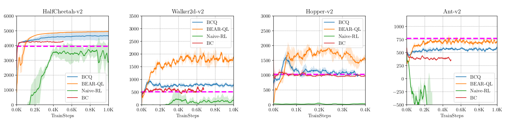
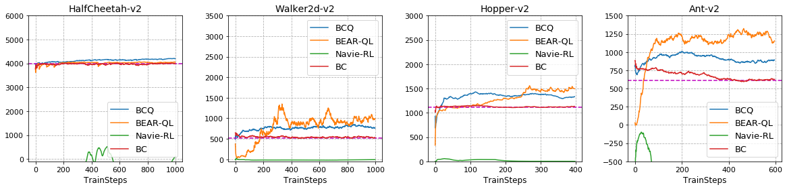
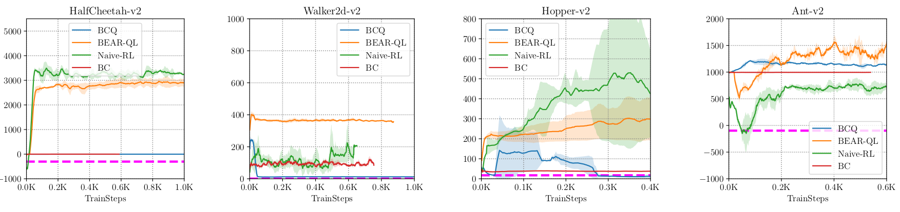
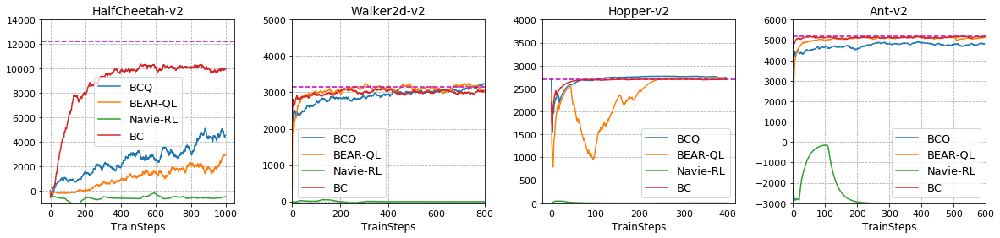

# BEAR-QL

This repository contains Tensorflow implementation of BEAR Q-Learning to reproduce the experiments described in ["Stabilizing Off-Policy Q-Learning via Bootstrapping Error Reduction"](https://arxiv.org/abs/1906.00949) for [NeurIPS 2019 Reproducibility Challenge](https://openreview.net/forum?id=S1lXO6cf6S).

## Dependencies
- Python 3.6 or greater
- Tensorflow 1.14.0
- Numpy 1.15.4
- OpenAI Gym version 0.12.5
- Matplotlib
- Mujoco version 1.50 and mujoco_py-1.50.1.56

## Dataset
BEAR Q-Learning is an off-policy RL algorithm and it is trained on static datset. You can generate dataset using [Soft Actor-Critic (SAC)](https://github.com/rail-berkeley/softlearning) algorithm as denoted in the paper or directly download [our datasets](https://github.com/seungwon1/BEAR-QL/tree/master/buffers) used in reproducibility report.

## Train BEAR-QL
To train BEAR-QL, execute below command (It assumes static dataset is in buffers/).
```
python main.py --game=Ant --version=v2 --it=1000000 --batch=100 --lr=1e-3 --sample_p=5--sample=5 --eval_freq=1000 --buffer=buffer_filename --kernel=gs --sigma=20.0
```
Args
```
-game, version : MuJoCo game environments
-it : iterations for training
-batch : batch size to sample batch from dataset
-lr : learning rate of optimizer
-sample_p : number of action samples for target Q
-sample : number of action samples for MMD
-eval_freq : evaluation interval
-buffer : name of buffer file
-kernel : kernel for calculating mmd
-sigma : constant for kernel
```

Hyper-parameters used for BEAR-QL
```
- batch size = 100, learning rate = 1e-3, sample_p = 5, sample = 5, eval_freq = 1000
- kernel : gs(gaussian kernel) for medium-quality dataset of Walker2d-v2 and Ant-v2 and random dataset of HalfCheetah-v2, lp(laplacian kernel) for others
- sigma : 10.0 for HalfCheetah-v2 and Hopper-v2, 20.0 for Walker2d-v2 and Ant-v2
```

Metrics such as loss or evaluation reward can be easily visualized using tensorboard.
```
tensorboard --logdir=results/directory_name
```

## Results

Below figures show the results of experiments with different datasets (Top:paper, Bottom:ours). The official implementations of [BCQ](https://github.com/sfujim/BCQ) and [TD3](https://github.com/sfujim/TD3) are used for baseline algorithms. 

### Medium quality Dataset



### Random Dataset



### Optimal Dataset




## Hardware
Each algorithm is trained on a single RTX 2080 ti.
